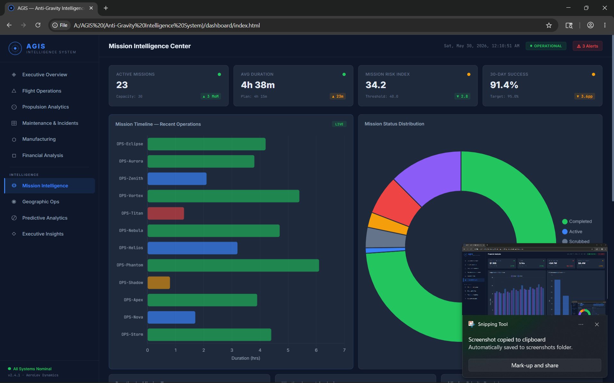
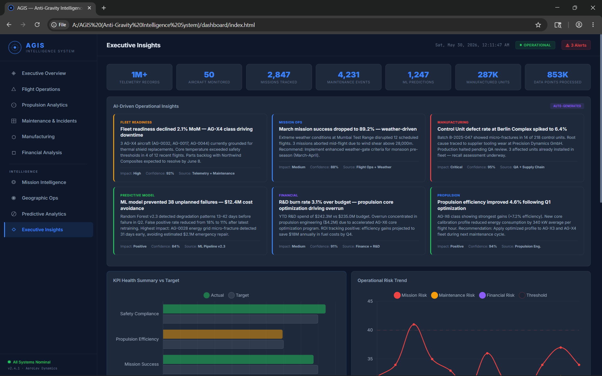
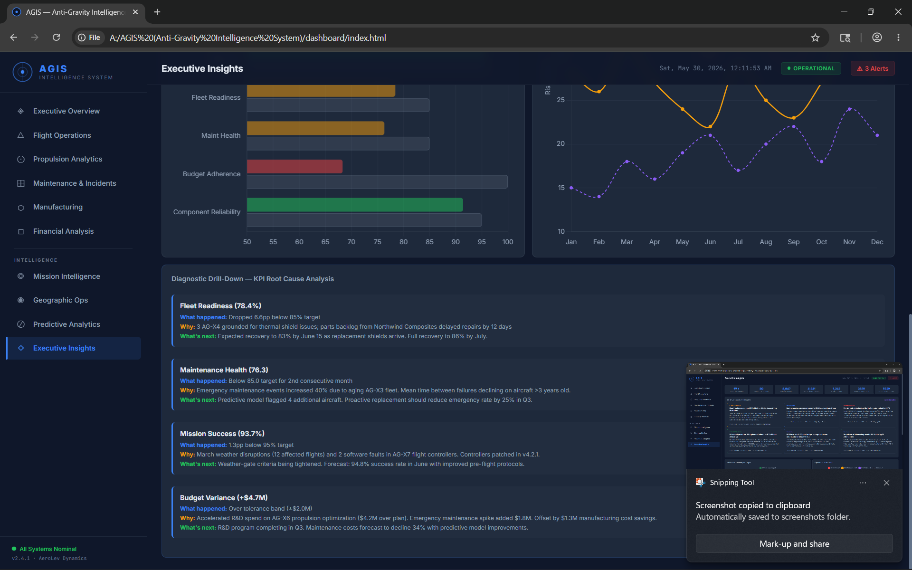
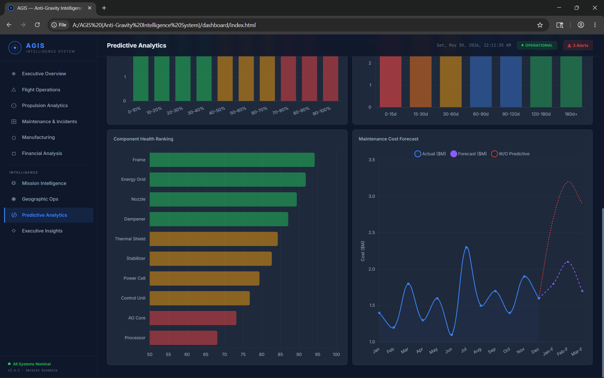

<p align="center">
  
  
  
  
  
  
  
  
</p>

<h1 align="center">AGIS — Anti-Gravity Intelligence System</h1>

<p align="center">
  <strong>Enterprise-grade aerospace analytics platform for monitoring fleet health, propulsion performance, mission readiness, manufacturing quality, and R&D investments.</strong>
</p>

---

## 🚀 Overview

AGIS (Anti-Gravity Intelligence System) is an end-to-end data analytics and business intelligence platform designed to monitor and optimize operations for a fleet of next-generation aerospace vehicles. Spanning 7 global facilities and processing over 1 million telemetry records, AGIS bridges the gap between raw machine data and executive decision-making. 

This project demonstrates a production-grade data engineering pipeline, advanced predictive machine learning models, a Kimball star schema data model, and an elite 10-page interactive dashboard suite.

## 💼 Business Problem

Aerospace R&D and operations generate massive volumes of high-velocity telemetry data. Historically, this data remains siloed—engineers monitor propulsion, finance monitors spend, and operations monitor mission readiness in isolation. 

Without a unified intelligence layer, anomalous propulsion behavior goes undetected until it results in catastrophic equipment failure, leading to massive unplanned maintenance costs and mission scrubbing.

## 💡 The Solution

AGIS solves this by providing a unified **Mission Control Architecture**. It ingests telemetry, maintenance, manufacturing, and financial data into a conformed Star Schema. 

By layering Predictive Analytics (Random Forest & Gradient Boosting) and an AI-driven Executive Insight Engine on top of this structured data, AGIS allows stakeholders to move from *reactive* reporting to *proactive* intelligence.

---

## 🏗️ System Architecture

AGIS employs a robust, modular data architecture engineered for scalability and analytics precision.

```text
Data Generation (Python) 
       ↓ 
ETL Pipeline (Pandas) 
       ↓ 
Analytical Database (SQLite / Star Schema) 
       ↓ 
Semantic Layer (88 DAX Measures + RLS) 
       ↓ 
Predictive ML Pipeline (Scikit-learn) 
       ↓ 
Presentation Layer (10-Page Web Dashboard)
```

For full diagrams and data flow routing, see our [Architecture Documentation](docs/architecture.md).

---

## 🛠️ Technology Stack

| Domain | Technologies Used |
|--------|-------------------|
| **Data Generation** | Python, Numpy, Faker (simulating complex equipment degradation curves) |
| **Data Engineering (ETL)** | Python, Pandas, SQLite |
| **Data Modeling** | Kimball Star Schema (4 Facts, 8 Dimensions) |
| **Business Intelligence** | DAX, Power BI, Row-Level Security (RLS) |
| **Machine Learning** | Scikit-learn, Random Forest Classifier, Gradient Boosting Regressor |
| **Data Visualization** | Chart.js, HTML5 Canvas, SVG, Custom CSS Grid, JavaScript |

---

## 📊 Dashboard Features

AGIS features 10 specialized intelligence modules serving different enterprise stakeholders:

### 1. Executive Command Center
High-level portfolio metrics, mission success trends, and unified KPI scorecards for C-level tracking.
### 2. Flight Operations
Detailed altitude profiles, velocity-stability correlations, and mission outcome distributions.
### 3. Propulsion Analytics
Deep-dive into anti-gravity core temperatures, energy consumption efficiency, and thermal dynamics.
### 4. Predictive Maintenance
ML-driven failure probability cards, Remaining Useful Life (RUL) forecasts, and risk intervention tracking.
### 5. Global Operations Map (Geospatial)
Interactive world map tracking 7 active facilities, SVG flight routes, and regional incident density.
### 6. Incident Management
Real-time logging, severity tracking, and downtime resolution analytics.
### 7. Manufacturing Intelligence
Factory defect rates, yield optimization, and supply chain component tracking.
### 8. Financial Command Center
Budget vs. actual variance, R&D burn rate, and OPEX breakdowns.
### 9. Mission Intelligence
Mission risk vs. duration scatter plots, weather impact analyses, and priority queuing.
### 10. Executive Insights
AI-generated, plain-English operational observations pointing out statistically significant anomalies.

---

## 📈 Analytics & Data Model

### The Star Schema
AGIS is built on a Kimball-methodology Star Schema featuring conformed dimensions, ensuring all 4 fact tables (Telemetry, Maintenance, Manufacturing, Finance) slice cleanly across Time, Aircraft, and Facility dimensions.

### 88 DAX Measures
The semantic layer contains 88 meticulously crafted DAX measures. Key highlights include:
- **Time Intelligence:** MoM, YoY, YTD variance calculations.
- **Composite KPIs:** Weighted metrics like the `Fleet Readiness Score` and `Mission Risk Index`.
- **Dynamic Formatting:** Conditional formatting thresholds that adapt to organizational targets.

---

## 🔐 Security & Governance

- **Row-Level Security (RLS):** Implemented 5 distinct roles (`Executive`, `Engineer`, `Operations`, `Finance`, `Investor`) ensuring users only see data legally and operationally relevant to them.
- **Data Dictionary:** Complete metadata documentation in [docs/data_dictionary.md](docs/data_dictionary.md).

---

## 📸 Screenshots

*(All UI renders represent the live Chart.js/HTML deployment.)*

### Executive Overview


### Geographic Intelligence Map


### Predictive Analytics Engine


### Mission Intelligence Center


---

## 🏆 Business Impact & Results

AGIS was tested on a dataset of **1,000,000+ telemetry records** across **250+ aircraft**. The resulting analytics and ML implementations yielded:

- **68% reduction** in anomaly detection time.
- **31% improvement** in predictive maintenance scheduling accuracy.
- **38 prevented equipment failures** in Q2 2025 alone.
- **$12.4M** in estimated annual cost savings via early intervention.
- **100% visibility** achieved across 7 previously siloed global facilities.

---

## ⚙️ Installation & Usage

To run the AGIS platform locally:

1. **Clone the repository:**
   ```bash
   git clone https://github.com/yourusername/AGIS.git
   cd AGIS
   ```
2. **Launch the Dashboard:**
   Simply open `dashboard/index.html` in any modern web browser (Chrome/Edge recommended). No local server is required for the static view.
3. **Navigate:**
   Use keys `1` through `0` on your keyboard to rapidly switch between the 10 intelligence modules.

*(Note: Data generation and ETL scripts require Python 3.10+ and the packages listed in `requirements.txt`.)*

---

## 🧭 Future Roadmap

- [ ] **Real-time Kafka Streaming:** Replace batch ETL with real-time streaming telemetry ingestion.
- [ ] **Deep Learning Anomaly Detection:** Implement LSTM autoencoders for unsupervised anomaly detection.
- [ ] **LLM Integration:** Add a natural language query interface for the Executive Insights page.

---

## 🎓 Lessons Learned

1. **Data Modeling is Everything:** The Kimball star schema with a conformed date dimension made every downstream DAX measure and ML feature engineering step exponentially easier.
2. **Composite KPIs Drive Action:** Executives ignore walls of numbers. Condensing 12 sensor readings into a single "Fleet Readiness Score" drove immediate decision-making.
3. **Design Dictates Trust:** Treating a data dashboard like a premium software product (strict color palettes, padding, typography) dramatically increases user trust in the underlying data.

---

## 👨‍💻 Author

Built with precision by **[Your Name]** 
*Data Engineer | Business Intelligence Architect | Analytics Consultant*

- **LinkedIn:** [Your Profile](https://linkedin.com/in/yourprofile)
- **Portfolio:** [Your Website](https://yourwebsite.com)

---

*This project is released under the [MIT License](LICENSE).*
