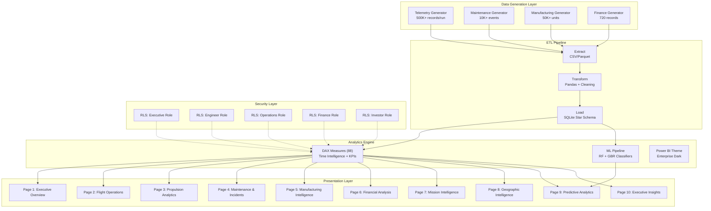
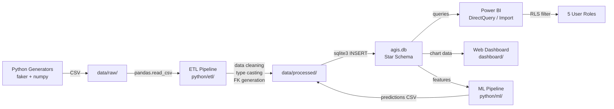
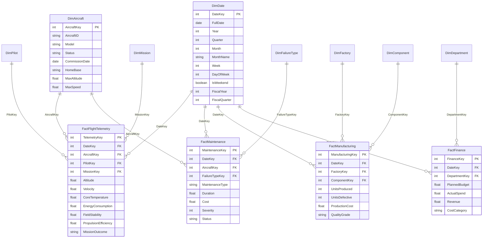
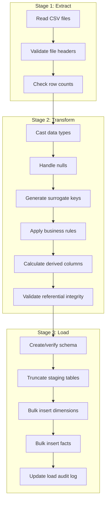
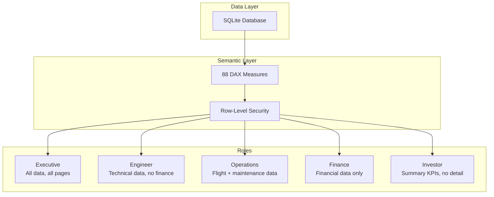
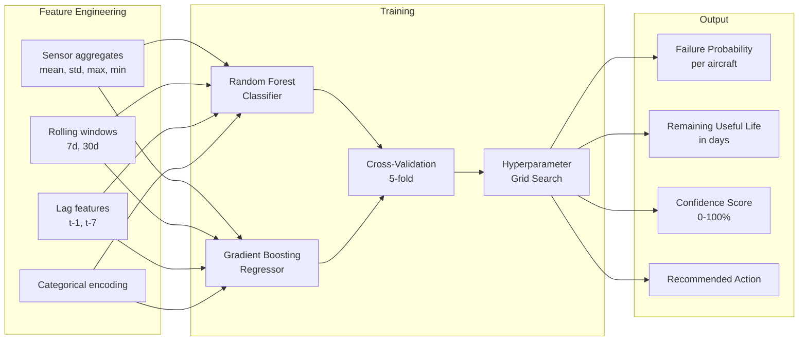
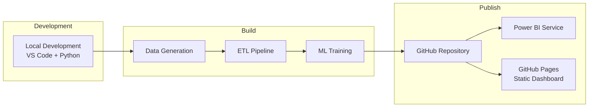

# AGIS — Architecture Documentation

## 1. System Architecture

---

## 2. Data Flow Diagram

---

## 3. Star Schema (ER Diagram)

---

## 4. ETL Pipeline Detail

---

## 5. Security Architecture

---

## 6. ML Pipeline Architecture

---

## 7. Deployment Architecture

